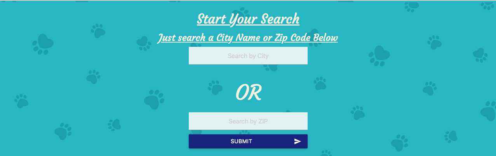
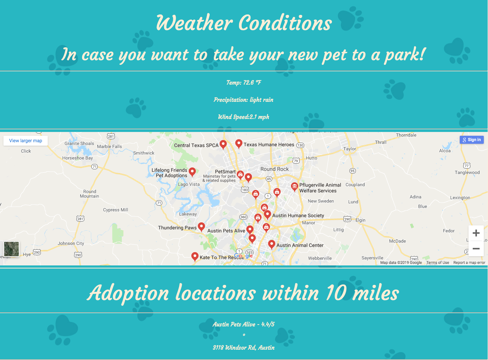

# CEP_Project1_PetFinder

Thanks for checking out our Project!

Contributors: Dylan Rutter, Shelly Branch

This is our Pet Finder App. The goal is to help aid in pet adoption. A topic I've always been very passionate about. Once I had drafted up a rough draft of api functionality on codepen,https://codepen.io/dylan-rutter/pen/byyzZm, Shelly was able to get a grid up with some scrolling and mobile functionality. 

Future goals would be adding user log in functionality to start off by saving a list of places you want to visit later on. 

The App uses 5 API's
1. Google Maps
2. Google Places
3. Google Geocoding
4. zipcode api
5. Open Weather 

You Start By Entering a search in the search bar

If you search via city name, the geocoding api would kick in to reverse search the city name to gain the latitude and longitude information to feed to Google Maps. The same happens for zip searches, but uses the zipcodeapi.com api to get the same information for a zip code and finding what area that zip code belongs to. 

We use that same information to send a get request to the open weather api to get some local weather information to include in the search. Then Its a list of locations and a map to get directions if needed!

